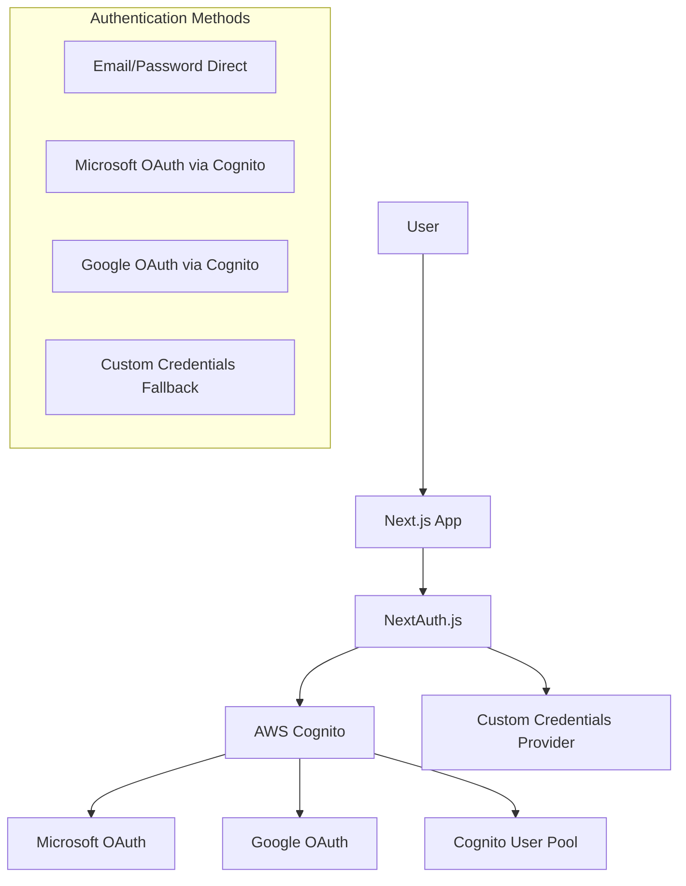
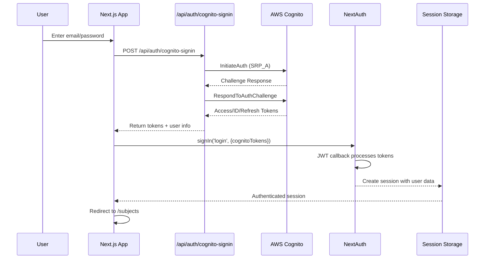
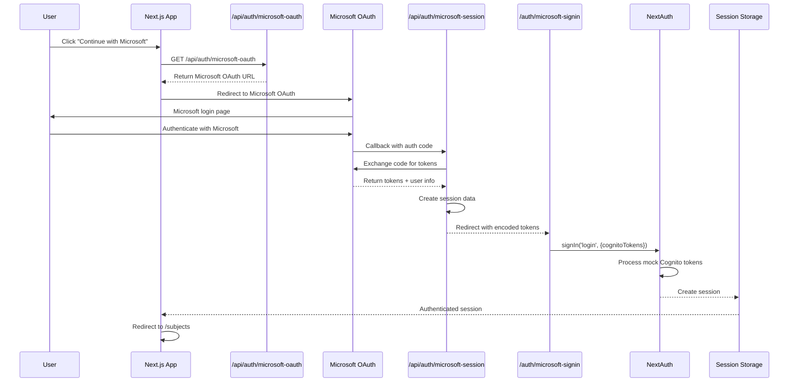
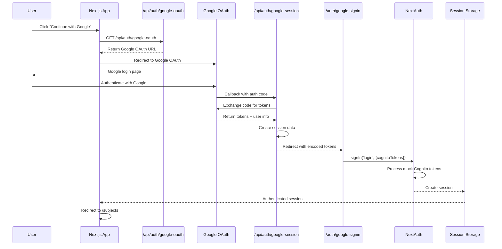
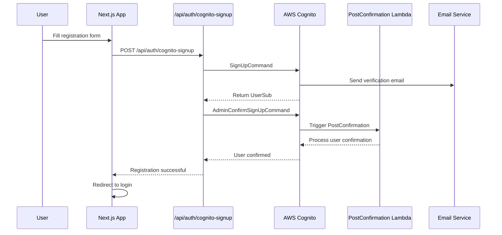
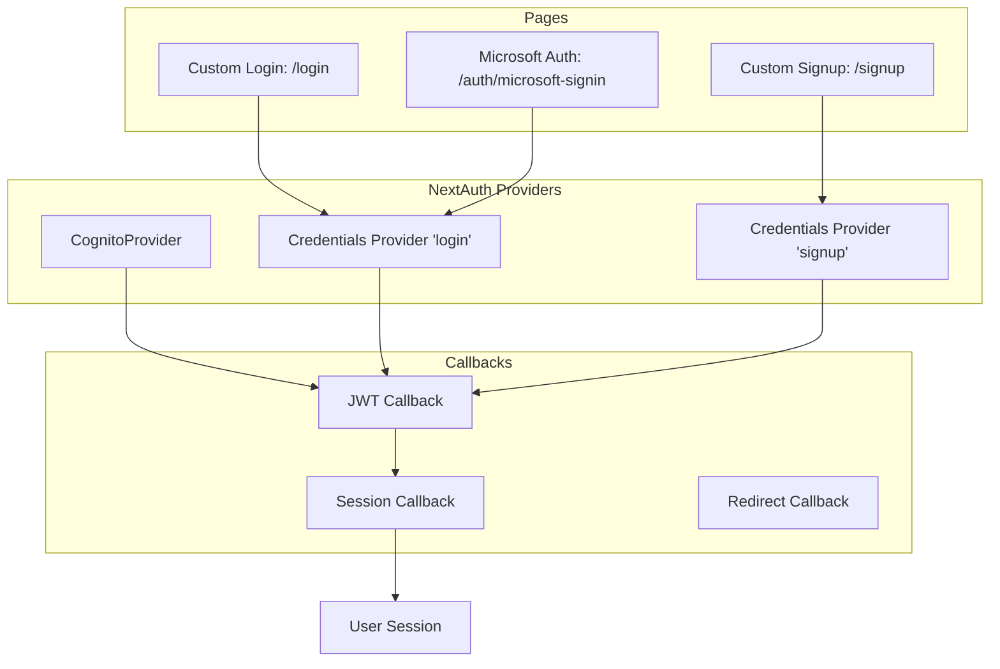
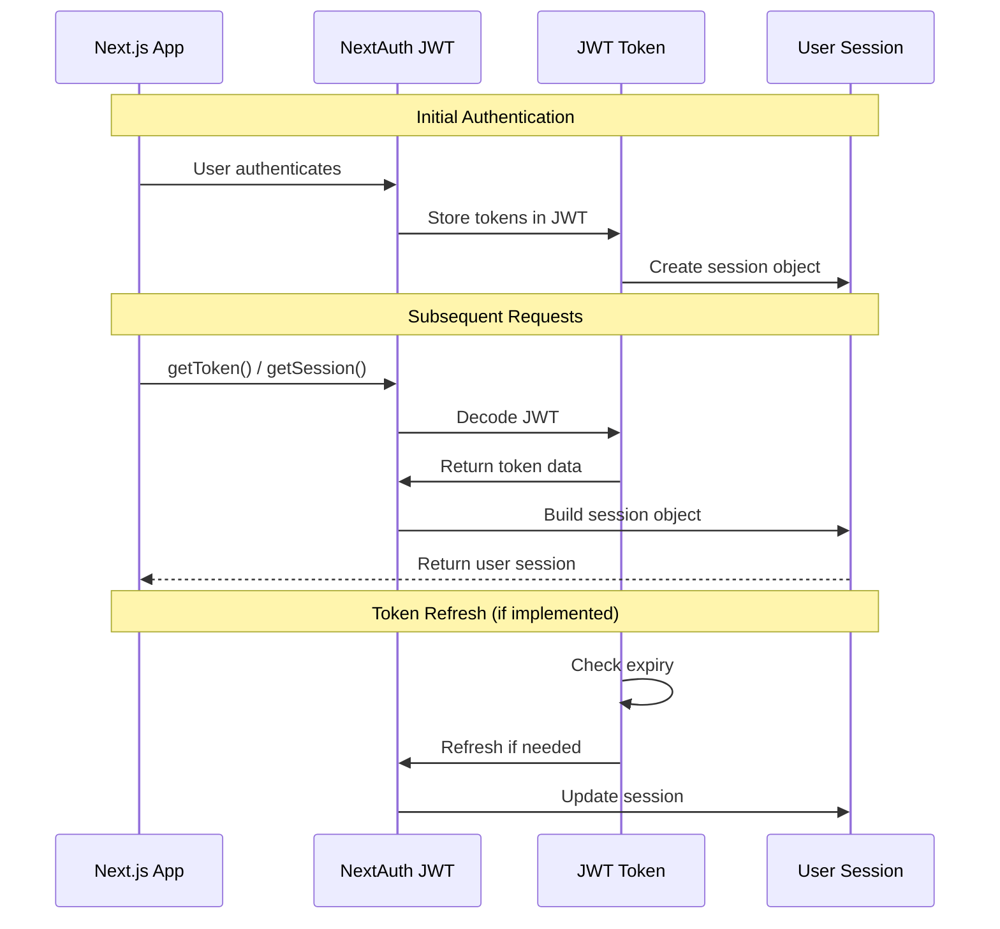
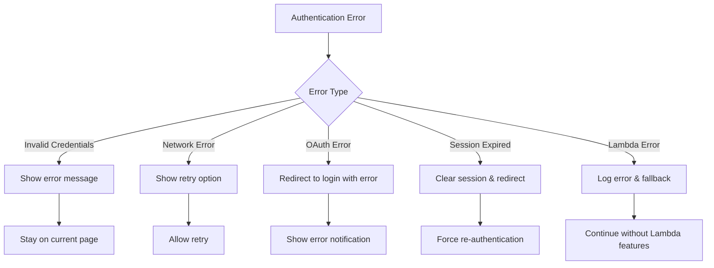

# Authentication Flow Documentation

## Complete Authentication Flow Diagram

This document shows the authentication flows implemented in the Jason Learning application with AWS Cognito and NextAuth.

## 1. Overall Authentication Architecture



## 2. Detailed Authentication Flows

### 2.1 Direct Email/Password Login Flow



### 2.2 Microsoft OAuth Flow



### 2.3 Google OAuth Flow



### 2.4 User Registration Flow



## 3. NextAuth Configuration Flow



## 4. Middleware Protection Flow

```mermaid
graph LR
    A[Incoming Request] --> B{Has Valid Token?}
    B -->|No| C{Is Auth Route?}
    C -->|No| D[Redirect to /login]
    C -->|Yes| E[Allow Access]
    B -->|Yes| F{Is Login Route?}
    F -->|Yes| G[Redirect to /subjects]
    F -->|No| H{Is Root Route?}
    H -->|Yes| I[Redirect to /subjects]
    H -->|No| E
    
    subgraph "Protected Routes"
        J[/subjects]
        K[/dashboard]
        L[Any non-auth route]
    end
    
    subgraph "Auth Routes (Excluded)"
        M[/login]
        N[/signup]
        O[/auth/microsoft-signin]
        P[/auth/google-signin]
        Q[/api/auth/*]
    end
```

## 5. Token Management Flow



## 6. Error Handling Flow



## Key Components

- **NextAuth.js**: Handles session management and authentication flow
- **AWS Cognito**: Primary identity provider for email/password auth
- **Microsoft/Google OAuth**: Social login providers
- **Custom Credentials Provider**: Fallback and token processing
- **Middleware**: Route protection and authentication checks
- **Custom Pages**: Login/signup forms with social login options

## Security Features

1. **JWT Strategy**: Secure token storage in HTTP-only cookies
2. **Route Protection**: Middleware enforces authentication
3. **Token Validation**: JWT parsing and validation
4. **Secure Redirects**: Controlled post-auth navigation
5. **Error Handling**: Graceful error management and user feedback 